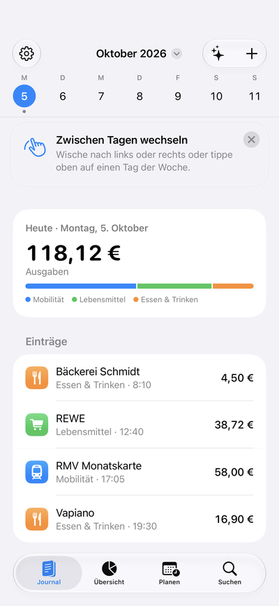
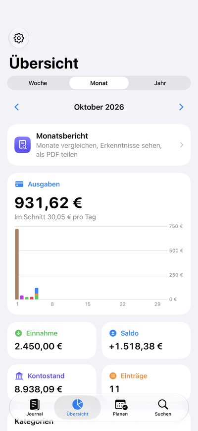
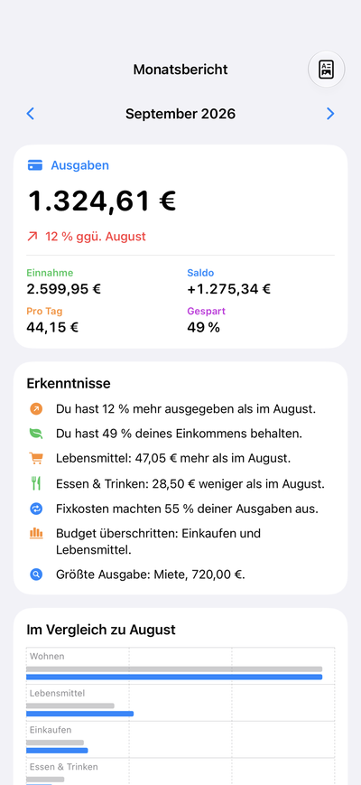
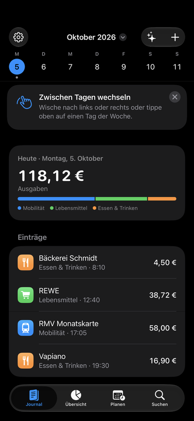
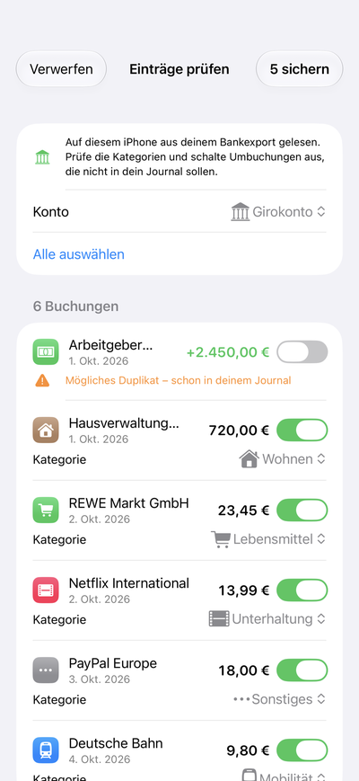
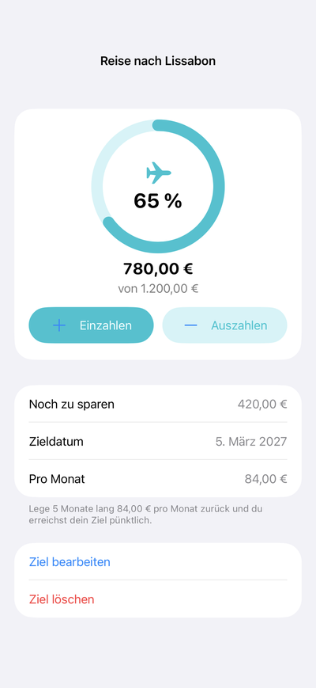
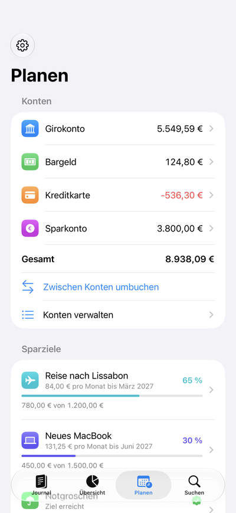
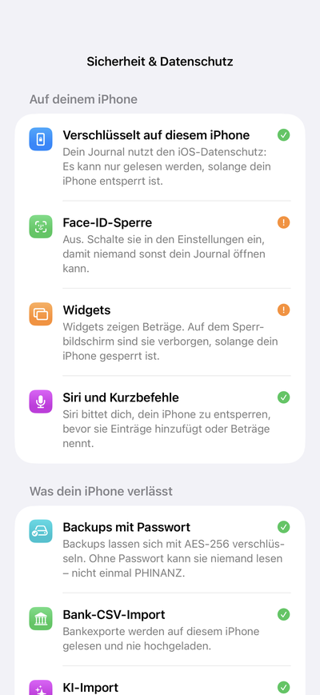

# PHINANZ

**Dein Finanztagebuch fürs iPhone – eine Seite pro Tag.**

PHINANZ ist eine native iOS-App, mit der du Ausgaben und Einnahmen so einfach festhältst wie in einem Tagebuch: Jeder Tag hat seine eigene Seite, die Tagessumme steht oben. Statt Formulare abzutippen, sprichst du eine Sprachnotiz ein, fotografierst einen Beleg oder lädst einen Kontoauszug hoch. Die KI (Google Gemini) macht daraus Einträge, die du vor dem Speichern prüfst. CSV-Kontoauszüge deutscher Banken liest die App sogar komplett offline.

Gemacht für den deutschen Markt (Euro, deutsche Zahlenformate, deutsche Banken), auf Deutsch, Englisch und Persisch (von rechts nach links), im hellen und im dunklen Design.

  
  
  
  

  
  
  
  

## Funktionen

**Journal**

- Wochenleiste wie in der Kalender-App und eine Seite pro Tag, durch die du wischst (365-Tage-Kalender mit Lazy Loading)
- Tagessumme mit Kategorie-Balken, „Heute“-Button und Sprung zu jedem Datum
- Ausgaben und Einnahmen mit Händler, Betrag, Kategorie, Datum, Uhrzeit, Notiz und Konto
- Die Kategorie wird beim Tippen vorgeschlagen: aus deinem Verlauf und aus bekannten deutschen Händlern (REWE, Deutsche Bahn, Netflix, Miete …)

**Import**

- KI-Import mit Google Gemini: Sprachnotiz, Beleg (Dokumentenscanner oder Fotomediathek) und Kontoauszug als PDF werden zu strukturierten Einträgen
- Jeder KI-Vorschlag landet zuerst in einer Prüfansicht – nichts wird ohne deine Bestätigung gespeichert
- Bank-CSV-Import direkt auf dem iPhone, ohne KI und ohne Internet: Sparkasse, ING, DKB, N26, Commerzbank, comdirect, Volksbank, Postbank und andere; Duplikate werden erkannt
- Eigene PH-Ladeanimation, während Gemini die Datei liest

**Planen und auswerten**

- Mehrere Konten (Girokonto, Bargeld, Kreditkarte, Sparkonto) mit eigenem Saldo und Umbuchungen
- Monatsbudgets pro Kategorie mit Warnung bei 80 % und bei Überschreitung
- Daueraufträge wie Miete, Abos oder Gehalt werden jeden Monat automatisch gebucht
- Sparziele mit Fortschrittsring und Vorschlag wie „150 € pro Monat bis April“
- Übersicht für Woche, Monat und Jahr mit Swift Charts
- Monatsbericht mit Vergleich zum Vormonat, verständlichen Erkenntnissen und PDF-Export
- Suche nach Händler, Kategorie, Notiz, Betrag oder Monat; ein Tipp auf ein Ergebnis blättert das Journal zu diesem Tag

**Auf dem iPhone zu Hause**

- Widgets für Home- und Sperrbildschirm sowie ein Steuerelement im Kontrollzentrum
- Siri und Kurzbefehle, zum Beispiel „Ausgabe in PHINANZ hinzufügen“
- Erinnerungen, Tipps mit TipKit und eine Seitenleiste auf dem iPad
- Optionaler Abgleich über iCloud (private CloudKit-Datenbank)

## Sicherheit und Datenschutz

- Kein Benutzerkonto, keine Werbung, kein Tracking: Die Daten bleiben auf dem Gerät
- Face-ID-Sperre in einem eigenen Fenster über allen Ansichten und Sichtschutz im App-Umschalter
- Die Datenbank ist mit der Datenschutzklasse von iOS (Data Protection) verschlüsselt
- Backups mit Passwort: PBKDF2-SHA256 mit 600.000 Runden und AES-256-GCM
- Der Gemini-API-Schlüssel liegt nur im Schlüsselbund dieses Geräts; Anfragen laufen über eine flüchtige Netzwerksitzung ohne Cache
- An die KI geht nur die Datei, die du selbst auswählst, und erst nach deiner ausdrücklichen Zustimmung
- Siri-Aktionen nur bei entsperrtem iPhone, Widgets können Beträge ausblenden, Mitteilungen enthalten keine Beträge
- Privacy Manifest für App und Widget; Details im [Sicherheitskonzept](docs/SECURITY.md)

## Technik

- Swift, SwiftUI und SwiftData für iOS 26 mit Liquid Glass
- Swift Charts, WidgetKit, App Intents und TipKit
- VisionKit (Dokumentenscanner), AVFoundation (Sprachaufnahme) und PhotosUI
- CryptoKit, CommonCrypto, LocalAuthentication und der Schlüsselbund
- Google Gemini über die REST-API (`generateContent` mit JSON-Schema). Standardmodell ist `gemini-2.5-flash`; es lässt sich in den Einstellungen ändern
- Keine Bibliotheken von Drittanbietern
- Architektur: SwiftUI-Views und SwiftData-Modelle; die Logik steckt in kleinen, testbaren Services (`@Observable`-Controller und reine Funktionen). Mehr dazu in [ARCHITECTURE.md](docs/ARCHITECTURE.md)

## Tests

- 89 automatische Tests: 82 Unit-Tests mit Swift Testing und 7 UI-Tests mit XCTest
- Rund 10.700 Zeilen Swift

## Projekt starten

1. `Phinanz.xcodeproj` in Xcode 26 oder neuer öffnen.
2. Einen iPhone-Simulator wählen und **Run** drücken (Deployment Target: iOS 26.4).
3. Tests mit **Cmd+U** ausführen.

**KI-Import einschalten:** Einen Schlüssel im [Google AI Studio](https://aistudio.google.com/apikey) erstellen. Dann in der App unter **Einstellungen** den Schalter **KI-Import** einschalten, den Schlüssel einfügen und auf **API-Schlüssel sichern** tippen.

**iCloud-Abgleich (optional):** braucht ein kostenpflichtiges Apple-Developer-Konto. Die Schritte stehen in der [englischen Anleitung](docs/README.en.md).

## Versionen

Alle Änderungen stehen im [CHANGELOG](CHANGELOG.md) und unter [Releases](../../releases).

## Status und Ausblick

PHINANZ ist ein Lern- und Portfolio-Projekt und nicht im App Store erhältlich. Als Nächstes geplant:

- Import von CAMT.053 und MT940
- Beträge als `Decimal` statt `Double`
- Mehrere Währungen
- Apple-Watch-App
- Tests auf echten Geräten und eine Barrierefreiheits-Prüfung
- Veröffentlichung über TestFlight und den App Store

## Lizenz

© 2026 Farhan Hashemi. Alle Rechte vorbehalten.
